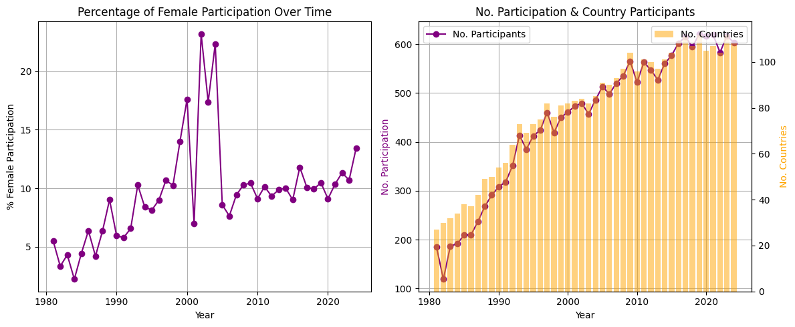
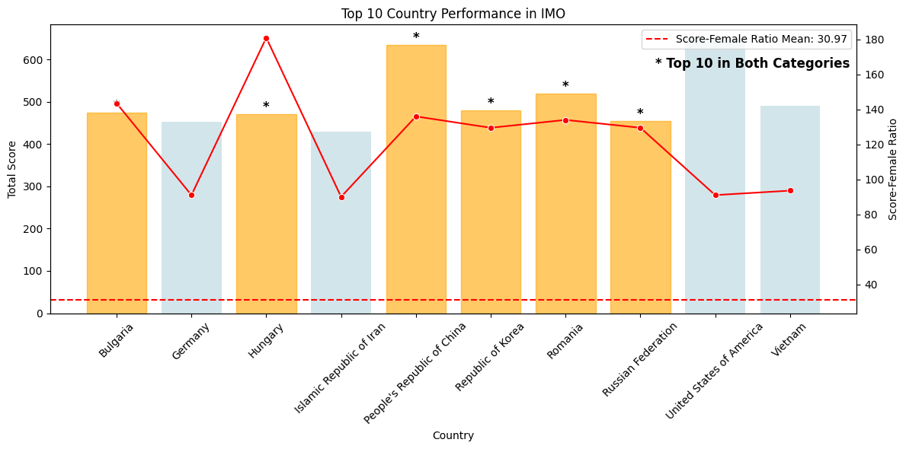
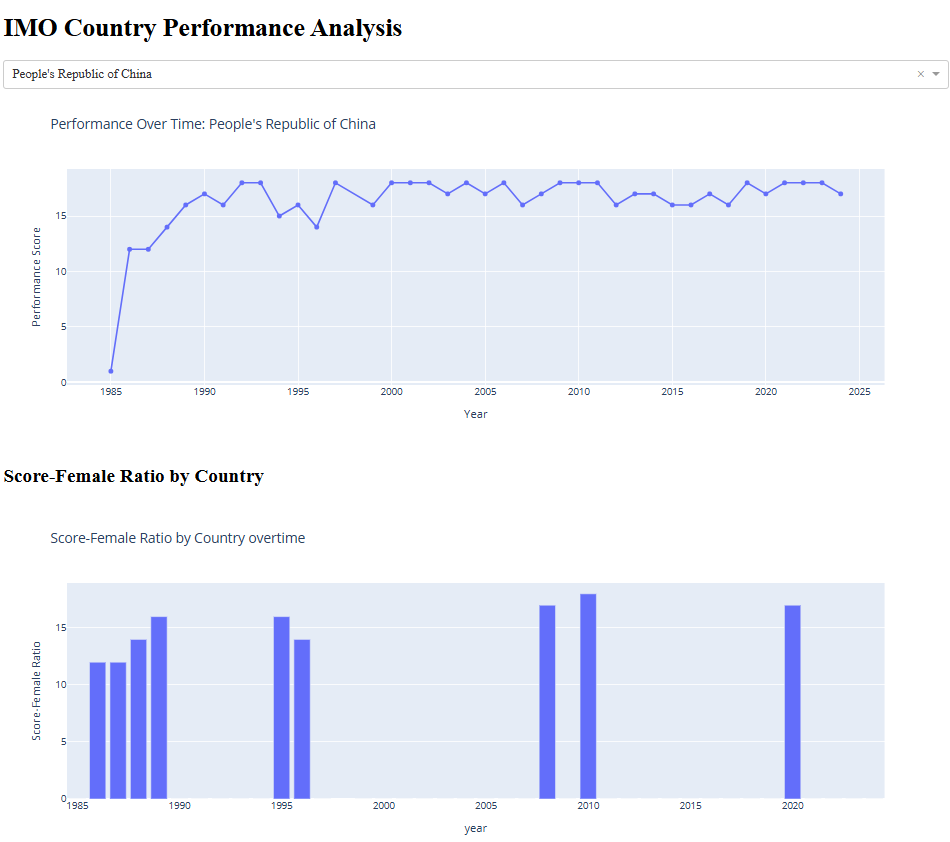
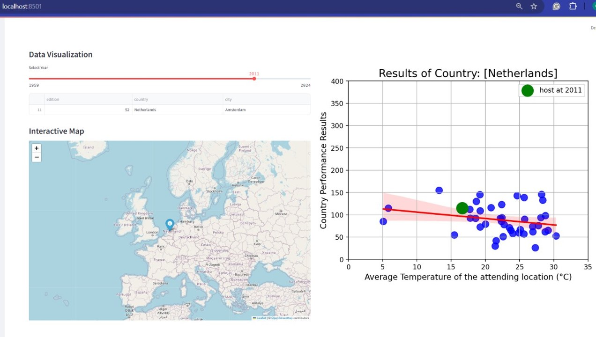

# Project 1 report (Write-up)
## Introduction
The **International Mathematical Olympiad (IMO)** is the premier global mathematics competition for high school students, held annually in a different country. The first IMO was held in 1959 in Romania with participation from just 7 countries. Since then, the competition has grown substantially, attracting over 100 countries across five continents. The contest consists of 6 challenging problems, administered over two consecutive days, with three problems each day.

This dataset was compiled by [Havisha Khurana](https://github.com/havishak) and published on [TidyTuesday](https://github.com/rfordatascience/tidytuesday/blob/main/data/2024/2024-09-24/readme.md). It is organized into three main components: country-level performance, individual participant data, and hosting information. Country-level data includes the year (`year`), country name (`country`), and team sizes (`team_size_all`, `team_size_male`, `team_size_female`). Gender-specific data has been consistently available only since 2020, and earlier entries often contain missing values (`NA`). When one of the gender-specific fields is missing, it can be inferred from the total team size; if both are missing, it is assumed that all participants were male. Medal counts (gold `awards_gold`, silver `awards_silver`, bronze `awards_bronze`) and honorable mentions (`awards_honorable_mentions`) are also included, offering a key indicator of national performance. Additionally, the names of team leaders (`leader`, `deputy_leader`) are recorded, highlighting the mentorship behind each team’s success.

Regarding the individual results, the name (`contestant`) and origin (`country`) of each participant is recorded, along with their scores on problems 1 through 6 (`p1`–`p6`) and total score (`total`). The individual rank (`individual_rank`) provides each contestant’s position among all participants globally, and their corresponding award (`award`) captures the level of recognition received. This portion of the dataset is especially valuable for analyzing individual excellence, identifying patterns in problem-solving strengths, and highlighting shifts in performance across regions or over time.

Lastly, timeline and host country information are also recorded. This includes the total number of contestants (`all_contestant`), and the number of participating male and female contestants (`male_contestant` and `female_contestant`) for each year. The number of participating countries is documented as well. Details about the hosting country and city, along with the event timeline (`start_date` and `end_date`), are included, enabling users to explore trends in global engagement and the geographical spread of hosting responsibilities. These details provide context for interpreting the competition environment and may reveal links between hosting and national performance.

Overall, the IMO dataset is a rich, multifaceted resource that opens up numerous possibilities for exploration — from performance analytics and gender studies to international educational trends and historical progression of global collaboration in mathematical excellence. In this project, we focus on which factors affect to countries' performance. There may be various factors, but we concentrate on 2 main factors regarding female participants rate and weather factor of host country comprare to attending countries.

## Question 1
### **How do female participants' ratings influence countries' performance?**
### Introduction
As observed from the dataset, male contestants have historically dominated participation in the International Mathematical Olympiad (IMO). However, gender equality and inclusiveness are vital markers of a nation's commitment to nurturing talent. Understanding how female participants influence a country’s performance in such a prestigious competition could provide insights into both educational equity and effective talent cultivation.

To investigate this, we explore the country-level performance data, which includes scores, medal distributions, and gender breakdowns of participants. Female representation is measured by calculating the percentage of female participants, and country performance is derived from a weighted score based on the type of medals achieved (e.g., gold medals have more value). This analysis aims to reveal whether nations with a higher proportion of female participants also achieve strong performance, highlighting the potential link between gender inclusiveness and competitive success.

### Approach
To address the question, we first observe the trend of female participation over time using a **line chart**, which clearly illustrates changes in female representation. Alongside this, we use a **combined bar and line chart** to show the number of participants and the number of participating countries over the years. This combined visualization helps establish the reliability of the trend—ensuring that increases in participation rates are not artifacts of small sample sizes.

After understanding long-term trends, we investigate whether there’s a relationship between country performance and female participation by analyzing the top 10 performing countries. For this, we use a **bar and line combined chart** where country performance (total score) is visualized alongside the score-female ratio. Highlighted bars indicate countries that rank in the top 10 in both performance and female ratio, providing visual cues for deeper interpretation.

We further provide an **interactive dashboard** that allows dynamic exploration of performance and female participation trends per country over time. This interactivity helps uncover nuances that may not be visible in static plots.

### Analysis
#### Percentage of Female Participation Over Time
```python
fig, axes = plt.subplots(1, 2, figsize=(12, 5))

# Plot the percentage of female participation
axes[0].plot(gender_participation['year'], gender_participation['female_percentage'], marker='o', color='purple')
axes[0].set_title("Percentage of Female Participation Over Time")
axes[0].set_xlabel("Year")
axes[0].set_ylabel("% Female Participation")
axes[0].grid(True)

# Plot the number of female participants with an additional bar chart for country participants
ax2 = axes[1].twinx()  # Create a secondary y-axis

# Line plot for female participants
axes[1].plot(gender_participation['year'], gender_participation['team_size_all'], marker='o', color='purple', label="No. Participants")

# Bar chart for number of countries
ax2.bar(gender_participation['year'], gender_participation['num_countries'], alpha=0.5, color='orange', label="No. Countries")

# Titles and labels
axes[1].set_title("No. Participation & Country Participants")
axes[1].set_xlabel("Year")
axes[1].set_ylabel("No. Participation", color='purple')
ax2.set_ylabel("No. Countries", color='orange')

# Grid and legend
axes[1].grid(True)
axes[1].legend(loc="upper left")
ax2.legend(loc="upper right")

plt.tight_layout()
plt.show()
```


#### Top 10 Country Performance in IMO

```python
# Get top 10 performing countries
top_countries = country_results_df.groupby('country')['score'].sum().nlargest(10)
top_female = country_results_df.groupby('country')['score_female_ratio'].sum().nlargest(10)

# Highlight countries appearing in both top lists
highlight_countries = top_countries.index.intersection(top_female.index)

# Prepare data for visualization
top_10_df = country_results_df.groupby('country')[['score', 'score_female_ratio']].sum().reset_index()
top_10_df = top_10_df[top_10_df['country'].isin(top_countries.index)]

# Compute mean score_female_ratio
top_female_mean = country_results_df.groupby('country')['score_female_ratio'].sum().mean()

# Plot country performance
fig, ax1 = plt.subplots(figsize=(12, 6))

# Bar chart for total score
bars = sns.barplot(data=top_10_df, x='country', y='score', ax=ax1, color='lightblue', alpha=0.6)
ax1.set_xticklabels(ax1.get_xticklabels(), rotation=45)
ax1.set_xlabel("Country")
ax1.set_ylabel("Total Score")
ax1.set_title("Top 10 Country Performance in IMO")

# Highlight specific bars and add labels
for bar, country in zip(bars.patches, top_10_df['country']):
    if country in highlight_countries:
        bar.set_color('orange')
        ax1.text(bar.get_x() + bar.get_width() / 2, bar.get_height(), '*', ha='center', va='bottom', fontsize=12, color='black', fontweight='bold')

# Secondary y-axis for score_female_ratio
ax2 = ax1.twinx()
sns.lineplot(data=top_10_df, x='country', y='score_female_ratio', marker='o', ax=ax2, color='red')
ax2.axhline(y=top_female_mean, color='red', linestyle='--', label=f'Score-Female Ratio Mean: {top_female_mean:.2f}')
ax2.legend()
ax2.set_ylabel("Score-Female Ratio")

# Add legend for highlighted countries
ax1.text(0.75, 0.85, "* Top 10 in Both Categories", transform=ax1.transAxes, fontsize=12, color='black', fontweight='bold')

plt.tight_layout()
plt.show()
```


#### An interactive chart to analyze the IMO Country Performance and Performance-Female Ratio by Country
This dashboard allows users to explore country-specific performance and female participation:

```python
# Dash App Setup
app = dash.Dash(__name__)

app.layout = html.Div([
    html.H1("IMO Country Performance Analysis"),
    
    dcc.Dropdown(
        id='country-selector',
        options=[{'label': c, 'value': c} for c in country_results_df['country'].unique()],
        multi=False,
        placeholder="Select a country..."
    ),
    dcc.Graph(id='country-performance-chart'),
    
    html.H2("Score-Female Ratio by Country"),
    dcc.Graph(id='female-rate-overview')
])

@app.callback(
    Output('country-performance-chart', 'figure'),
    [Input('country-selector', 'value')]
)
def update_country_performance_chart(selected_country):
    if not selected_country:
        return px.line(title="Select a country to display data")

    filtered_df = country_results_df[country_results_df['country'] == selected_country]
    
    fig = px.line(filtered_df, x='year', y='score', markers=True,
                  title=f"Performance Over Time: {selected_country}",
                  labels={'score': 'Performance Score', 'year': 'Year'})
    return fig

@app.callback(
    Output('female-rate-overview', 'figure'),
    [Input('country-selector', 'value')]
)
def update_female_rate_overview(selected_country):
    filtered_df = country_results_df[country_results_df['country'] == selected_country]
    fig = px.bar(filtered_df, x='year', y='score_female_ratio',
                 title="Score-Female Ratio by Country overtime",
                 labels={'score_female_ratio': 'Score-Female Ratio', 'country': 'Country'})
    return fig

if __name__ == '__main__':
    app.run(debug=True, port=8051)
```


### Discussion
The data shows that the percentage of female participation in the IMO has increased significantly since the 1980s, from under 5% to over 10% in recent years. Though still underrepresented, this positive trend reflects increasing gender inclusivity. The steady growth aligns with global educational reforms and gender equality movements encouraging STEM access for girls.

In terms of performance, our analysis of the top 10 countries reveals that 6 out of 10 also rank in the top 10 for female score contributions. This suggests that a high female participation rate does not hinder national performance—on the contrary, inclusive teams can still dominate globally. The highlighted countries (e.g., USA, China, Russia) often invest in broad-based talent development, suggesting that when girls are given equal opportunities, they contribute significantly to team success.

Overall, the analysis does not show any negative correlation between female participation and national performance. If anything, nations that include more female contestants appear equally or more competitive. This supports the argument for promoting female participation as both a moral imperative and a competitive advantage.

## Question 2
### **How on-site temperature affect host country performance?**

### Introduction
As diving in this, we see that while the host country often have advantages—such as familiarity with environment, time zone, and reduced travel fatigue—other external factors, such as climate conditions, may also play a role in influencing participant performance. Among these, temperature is a particularly interesting variable.  For the host country, whose students are accustomed to local conditions but may also carry the pressure of performing well, this becomes even more relevant. Hence, we aims to explore the relationship between on-site average temperature during the competition period and the performance of the host country’s team, providing insights into whether environmental conditions contribute to performance fluctuations across different years.


### Approach
**An interactive visualization exploring the relationship between host country performance and average temperature at IMO locations**

1. First, we use **OpenMeteo Weather API** to get the day-specific temperature given the city location. The code is as follows:
```python
def fetch_weather_data(city, lat, lon, start_date, end_date):
    """
    Function to fetch weather data for each city based on lat and lon
    """
    # API endpoint
    url = (
        f"https://archive-api.open-meteo.com/v1/era5?"
        f"latitude={lat}&longitude={lon}&"
        f"start_date={start_date}&end_date={end_date}&"
        f"hourly=temperature_2m&timezone=UTC"
    )
    
    # Send GET request
    response = requests.get(url)
    
    # If the request is successful
    if response.status_code == 200:
        json_data = response.json()

        # Extract time and temperature data
        times = json_data['hourly']['time']
        temperatures = json_data['hourly']['temperature_2m']

        # Create DataFrame for this city
        df_city = pd.DataFrame({
            "city": city,
            "datetime": times,
            "temperature_2m": temperatures,
        })

        return df_city
    else:
        print(f"Failed to fetch data for {city}. Status code: {response.status_code}")
        return None
```
2. Then, we use another source - **simplemaps.com** to get the location (latitude and longitude) of the given city. 
```python
def get_location_cities():
    df_world_cities = pd.read_csv("../external_data/simplemaps_worldcities_basicv1.77/worldcities.csv")
    df = st.session_state.data['timeline'].copy()\
            .merge(
                df_world_cities[['city', 'country', 'lat', 'lng']], 
                on=['city', 'country'], 
                how='left'
            )
    
    df.dropna(inplace=True)
    df = df.drop_duplicates(subset=['country', 'city'], keep='first')
    return df
```


3. We build Streamlit-based platform for interactive visualization



### Analysis
- We first save a database for all of the available location in the IMO dataset. Then we're able to retrieve  the location and day-specific temperature of the host city.​

```python
df = get_location_cities()
for _, row in df.iterrows():
    st.write(">>>Fechting: ", row['year'], row['city'])
    df.loc[_,'avg_temperature'] =  get_temperature(row)
df.to_csv("refs/df_timeline_temperature.csv")
```

- Also, we need to align city & country name across all datasets.

```python
def standardize_name(df):
    # Mapping dictionaries for countries and cities
    country_mapping = {
        "Russian Federation": "Russia",
        "United States of America": "United States",
        "Republic of Korea": "Korea, South",
        "Türkiye": "Turkey",
        "People's Republic of China": "China",
        "Czechoslovakia": "Czechia",
        "German Democratic Republic": "Germany",
        "Union of Soviet Socialist Republics": "Russia",
    }

    city_mapping = {
        "A distributed IMO administered from St Petersburg": "Saint Petersburg",
        "Taejon": "Daejeon",
        "Havanna": "Havana",
        "Taipeh": "Taipei",
    }

    # Apply the mappings to standardize names
    if 'country' in df.columns:
        df['country'] = df['country'].replace(country_mapping)
    if 'city' in df.columns:
        df['city'] = df['city'].replace(city_mapping)
    return df
```

- Calculate average temperature across IMO event days.

```python
def aggregate():
    """Function to aggreate data"""
    df_country = st.session_state.data['country']
    df = st.session_state.data['df']

    df_all = []
    for selected_year in df['year'].unique():
        df_host = df[df['year'] == selected_year]

        df_host_result = df_country[df_country['country']==df_host['country'].values[0]]
        df_host_result['performance_sum'] = df_host_result.iloc[:, 5:11].sum(axis=1)
        df_host_result = df_host_result.merge(
            df[['year', 'avg_temperature']], 
                on=['year'], 
                how='left'
        )
        df_host_result_clean = df_host_result[(df_host_result['performance_sum'] != 0) \
                        & (df_host_result['avg_temperature'].notna())]
        df_all.append(df_host_result_clean)


    df_all = pd.concat(df_all, axis=0)
    return df_all

```

- Scatter Plot:​ Plot the hostcountry's scoring result & the onsite-average temperature, (using all the year that the country participated)

```python
df_all = aggregate()
country = df_host['country'].values[0]
year = df_host['year'].values[0]
df_all = df_all[df_all['country'] == country]

df_all_spot = df_all[df_all['year'] == year]

# # Scatter plot with Seaborn for color mapping
fig, ax = plt.subplots(figsize=(8,6))
st.title("Scatter Plot with Regression Line and Correlation")

# Plot regression line and scatter points using seaborn
sns.regplot(
    x="avg_temperature", 
    y="performance_sum", 
    data=df_all, 
    scatter_kws={'s': 100}, 
    ax=ax, 
    color="blue", 
    line_kws={"color": "red"}
)
ax.scatter(
    df_all_spot['avg_temperature'], 
    df_all_spot['performance_sum'], 
    color="green", 
    s=300, 
    label=f"host at {year}"
)
# CONFIG
ax.set_title(f"Results of Country: [{country}]", fontsize=16)
ax.set_xlabel("Average Temperature of the attending location (°C)", fontsize=12)
ax.set_ylabel("Country Performance Results", fontsize=12)
ax.legend()
ax.grid(True)
ax.set_xlim(0, 35)
ax.set_ylim(0, 400)

# Display plot
st.pyplot(fig)

```

## Discussion
- For example, this interactive visualization explores the relationship between the on-site average temperature and the performance of the Netherlands in the IMO across different years. Each blue dot on the scatter plot represents the country's performance in a specific year, plotted against the average temperature of the host location during the competition. The green dot highlights the year when the Netherlands hosted the IMO (2011, in Amsterdam), indicating its own performance as host. 
- From the plot, we observe a slight negative correlation between temperature and performance, as illustrated by the downward-sloping red regression line. This suggests that higher temperatures may be slightly associated with lower performance results, though the trend appears weak and scattered. The regression line’s shaded area also indicates a wide confidence interval, reinforcing that the relationship may not be statistically strong. In 2011, when the Netherlands was the host, its performance was slightly above its average, placing the green marker noticeably higher than the regression line. This could imply a modest “home advantage” effect, where familiar conditions and local environment contributed positively to the team's result—even if the temperature was not particularly low or high that year

- Overall, while temperature may have some influence, performance appears to be more significantly impacted by other factors, such as student preparation, team selection, and problem difficulty. The host year result supports the idea that non-climatic local advantages could play a more notable role.